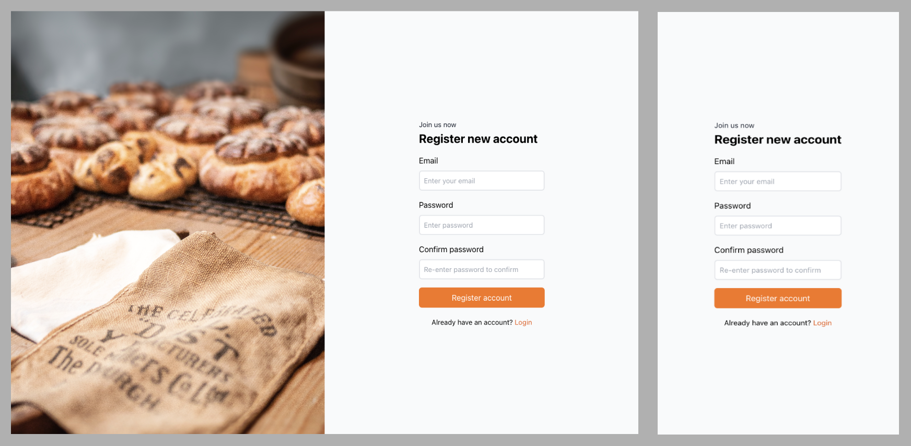

# Responsive signin, signup form with cover background

An example using Tailwind CSS 3.0 as a PostCSS plugin. Clone the template and write your own design.

    git clone https://github.com/pnqphong95/tailwind-css-starter-postcss.git {{ your project name }}

## Sign-in page

## Sign-up page

